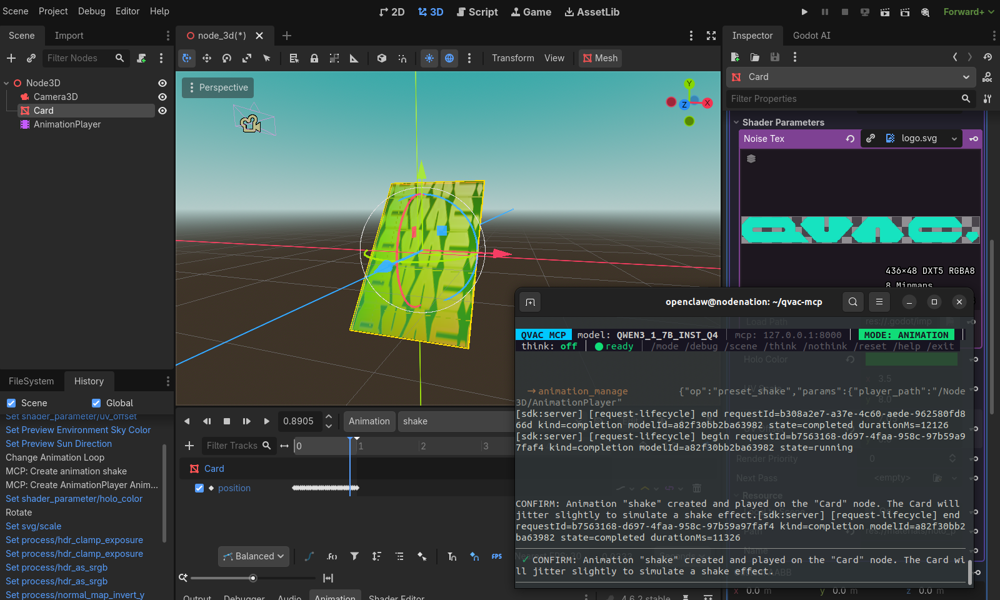

```
   _____     ___    ____   __  __  ____ ____  
  / _ \ \   / / \  / ___| |  \/  |/ ___|  _ \ 
 | | | \ \ / / _ \| |     | |\/| | |   | |_) |
 | |_| |\ V / ___ \ |___  | |  | | |___|  __/ 
  \__\_\ \_/_/   \_\____| |_|  |_|\____|_|    
```

# QVAC MCP

**A local AI agent that controls Godot 4 through MCP — running entirely on your own machine via the QVAC SDK.**

`#QvacMCP` · Apache-2.0 · QVAC Hackathon 2026

---

## What this is

QVAC MCP is not a prompt wrapper around a giant cloud model. It is a **generic MCP agent‑client** built on the [QVAC SDK](https://qvac.tether.io/), demonstrating that a **small language model running locally** — a 1.7B or 8B Qwen, on CPU or a modest GPU — can drive a real application (the [Godot](https://godotengine.org/) game engine) to do real work: create visible objects, color and shade them, transform them, and animate them.

It is built the way modern AI agents are built — less "creative prompting", more **systems engineering**:

- **System design** — the model, the ~40 MCP tools, the RAG layer and a mode system are coordinated so they don't get in each other's way.
- **Tool & contract design** — every tool the model can call has a strict, curated contract, so the model isn't left to "imagine" how an API works.
- **Retrieval engineering** — a two‑channel context system: a direct channel (always‑on principles) and a RAG channel (mode‑scoped tips retrieved by embeddings), so the right guidance reaches the model without competing noise.
- **Observability** — every inference and tool call is traced to `logs/inference.jsonl`, so failures are debugged by reading the trace, not by randomly editing prompts.

The agent is deliberately **scoped**: it is taught to do a handful of things well, as *principles* rather than memorized recipes, so it generalizes. The end user extends it with their own tools and docs for their own use case. **100% local inference, no cloud, no API keys** — `apis.json` is empty by design.

---

## How it works

```
You type a natural-language instruction
        │
        ▼
  ┌─────────────┐   mode-scoped tools + curated contracts
  │  QVAC MCP   │ ──────────────────────────────────────►  Local model (QVAC SDK)
  │   agent     │ ◄──────────────────────────────────────  decides which tool to call
  └─────────────┘   direct channel (principles) + RAG (tips)
        │
        ▼  MCP tool call
  ┌─────────────┐
  │  Godot AI   │  executes in the running Godot editor
  │  MCP server │
  └─────────────┘
```

The model never talks to the cloud. The QVAC SDK loads the model (and the embedding model for RAG) and runs inference on your device.

---

## Requirements

You will install three independent pieces. We link to the official sources rather than duplicating their instructions, so this guide stays valid even if their setup changes.

1. **Godot 4.6.x** — the game engine.
   Download from the official site: **https://godotengine.org/download**

2. **Godot AI (MCP server / addon)** — the plugin that exposes Godot's editor over MCP.
   Install it from its official project page and enable the plugin inside Godot:
   **https://github.com/hi-godot/godot-ai**
   *(Tested with server `godot-ai` v2.6.0. Newer versions should work; the agent talks to it over MCP at `127.0.0.1:8000`.)*

3. **Node.js 18+** — to run this agent client.
   **https://nodejs.org/**

---

## Install the QVAC MCP agent client

```bash
# 1. Clone
git clone https://github.com/PupusasGame/qvac-mcp.git
cd qvac-mcp

# 2. Install dependencies
npm install

# 3. (Optional) install the `qvacmcp` command globally
npm link
```

### Configure your environment

Create a `.env` file in the project root. The only variable you need is the model size:

```bash
# .env
# "small" = Qwen3 1.7B (faster, lighter — great on CPU)
# anything else / unset = Qwen3 8B (stronger, the demo model)
QVAC_MODEL=small
```

The QVAC SDK downloads and caches the model automatically on first run (into `~/.qvac/models/`). The agent was tested with:

- **`QWEN3_8B_INST_Q4_K_M`** — the primary demo model.
- **`QWEN3_1_7B_INST_Q4`** — the lightweight model (runs the full demo on CPU).
- **`EMBEDDINGGEMMA_300M_Q8_0`** — the embedding model used by the RAG layer.

Other settings (MCP host/port, RAG workspace, context size) live in `config/config.mjs` and have sensible defaults.

---

## Run it

Make sure **Godot is open** with the **Godot AI plugin enabled** first (the agent connects to it on startup).

Then, from inside the project folder:

```bash
# if you ran `npm link`:
qvacmcp

# or, without global install:
npm start
```

You'll get the QVAC MCP console: a status bar showing the active **MODE**, the connected model, and live feedback while the local model works.

### Console basics

| Command | What it does |
|---|---|
| `/mode <name>` | Switch the active mode (transform, material, animation, …) |
| `/scene` | Print the current Godot scene hierarchy |
| `/think` `/nothink` | Toggle model reasoning (slower/better vs. fast) |
| `/debug` | Show the mode / tools / RAG layers before each answer |
| `/reset` | Clear the conversation history |
| `/help` | List all commands |
| `/exit` | Shut down the agent |

The prompt shows the active mode, e.g. `[mode transform] you ›`. **Pick the mode that matches your task** — each mode exposes the right tools and guidance for that kind of work.

---

## Try it — a reproducible example

With Godot open and a fresh 3D scene, switch to the right mode and type these **one at a time**. This builds the QVAC holographic card: a flat, holographic, shaking card‑like object.

```
/mode transform
create a Cube name it Card and add a BoxMesh
set Card scale 2x3 and its z axis to 0.05 to make it flat
make Card look metallic

/mode material
apply the material res://materials/holo_premium.tres to Card

/mode animation
add AnimationPlayer to Card
make Card shake
```

Result:



> **Tip:** guiding the small model step by step — one clear, concrete instruction at a time — is far more reliable than one big ambiguous request. Be explicit about values that matter (give the axis and the number, e.g. *"its z axis to 0.05"*, instead of *"flatten it"*), and point the material step at the exact `.tres` path. Each step above runs in roughly 25–35s on a small local model.

*(The example uses a ShaderMaterial at `res://materials/holo_premium.tres`. A sample material is expected in your project; point the material step at whatever material exists, or create one first in material mode.)*

---

## Project layout

```
qvac-mcp/
├── main.mjs              # interactive console (REPL + UI)
├── config/config.mjs     # model, MCP, RAG and UI configuration
├── core/
│   ├── agent.mjs         # the agent loop: prompt assembly, tool calls
│   ├── modes.mjs         # modes: direct-channel principles + RAG tips
│   ├── tool-contracts.mjs# curated, strict tool contracts
│   ├── rag.mjs           # retrieval (embeddings, mode-scoped corpus)
│   ├── mcp.mjs           # MCP connection to the Godot AI server
│   └── model.mjs         # QVAC SDK model lifecycle
├── ui/theme.mjs          # console theme (brand gradient, colors)
└── apis.json             # empty — 100% local, no remote APIs
```

---

## License

Apache-2.0. See [LICENSE](LICENSE).

Built for the **QVAC Unleash Edge AI Hackathon 2026** — demonstrating local, private, edge AI with the QVAC SDK.
